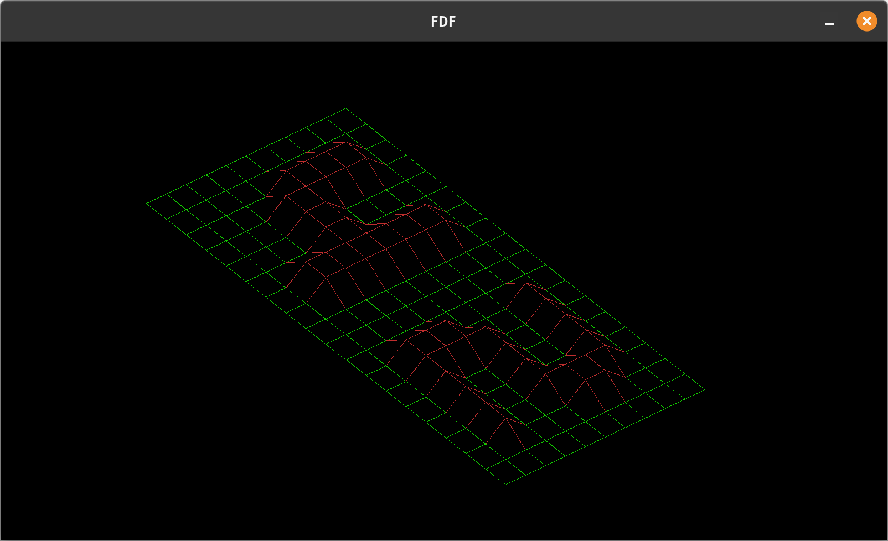

# FDF

Representing a landscape as a 3D object in which all surfaces are outlined in lines.

## Features

Here are some key features of the 3D object representation:

1. All surfaces are outlined in lines, creating a visually appealing landscape.
2. The object can be manipulated using various transformations, including zoom (z and x keys), translate (w, a, s, and d keys), rotate (q key), and scale (k and l keys).
3. Three color schemes are available to enhance the visual experience (p key).

For the detailed requirements, please refer to the [subject](./en.subject.pdf).

## Installation and Usage

To install Fdf, follow these steps:

1. Clone the repository from GitHub, navigate to the directory, build the pipex executable:

    ```
    git clone https://github.com/deniz-oezdemir/FDF
    cd FDF
    make
    ```

2. Run fdf with the desired map as input, e.g.:

    ```
    ./fdf maps/42.fdf
    ```

3. Manipulate the object using the following keys:
	* translate:	w, a, s, d
	* zoom:			z, x
	* scale:		k, l
	* rotate:		q

## Example 3D Object

The map [42.fdf](./maps/42.fdf) can be visualized and transformed into the following picture:



## Sources
1. [Explanation of MLX images, window refresh, endian, etc.](https://github.com/keuhdall/images_example)
2. [Explanations of Bresenham's line algorithm](https://github.com/aabduvak/FDF/tree/main)
3. [Key codes](https://www.cl.cam.ac.uk/~mgk25/ucs/keysymdef.h)
